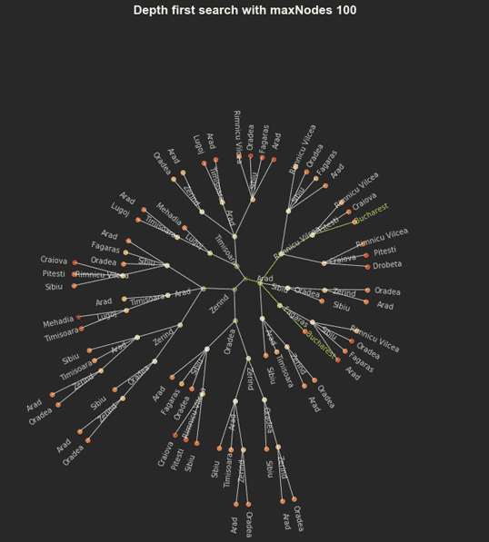
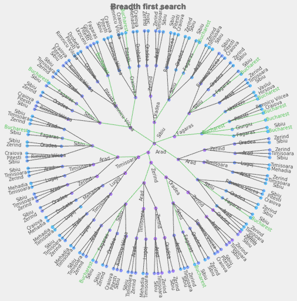

# Tree Search Algorithm and Visualization  
### Xian Lai
xian_lai@126.com

=======================================================


# Abstract
Searching is one of the most flexible way to deal with problem that can't be solved directly and exactly. By systematically exploring the state space, we will eventually reach the goal state we are looking for. If what we are interested is the path from initial state to goal state, then we need to save the states and orders we explored in a tree data structure. 

A wide range of searching algorithms like depth-first search, iterative deepening search, A* search etc. are developed for searching strategy for a long time. However, there is no visualization tools that shows the searching result nicely, intuitively and efficiently. The existing visualization tools of tree structure like plotly which expand the tree down-ward or right-ward are not suitable for the result tree structure of a searching algorithm because:  

1. As we know, the number of nodes usually increase exponentially when the searching goes deeper. Thus we will running out of space for the plotting of nodes quickly.  
2. It is extremely difficult to trace one path from initial state to the goal state for human eyes.


This project's goal is to implement a Python package that can be used in tree visualization without above-mentioned problems. The polar coordinate system is ideal for this purpose. In other words, the root node is put in the center of plot figure, then the tree grows outward. As we know, the diameter of a circle increases linearly w.r.t the radius. So we have more space for the nodes at deeper levels. And to increase the readability, each cluster of children nodes sharing the same parent node is centered on their parent and seperated from other clusters.


The coloring of the nodes and edges are designed based on searching algorithm as well. The coloring of nodes ranging from green to red are chosen based on their cost. And the edges on paths that leading to the goal state is marked green while the others are left in grey.


# Package 
#### Name: 
tree_search_plot
#### Modules:
- **TreeSearch**  
    This module implements the general tree search class that performs basic operations like expand node, evaluate state, append new nodes to tree as well as searching strategies like depth first search, breath first search and so on. It should be used as parent class for specific problem instance.
    And it requires this instance to have the following methods:

    - ProblemInstance._transition(state)
        The transition model takes in state and return possible actions,  
        result states and corresponding step costs.
    - ProblemInstance._heuristicCost(state)
        Calculate and return the heuristic cost given a state.
    - ProblemInstance._isGoal(state)
        Check whether given state is goal state or one of goal states.

    Some abbreviations used in this script:
    ```
        gnrt   : Nodes in the same generation or level of tree.
        clst   : Nodes in the same cluster(children of one parent) of tree.
        sibl   : A node in a cluster.
        peerIdx: The index of clst and sibl
        cousin : A node in other cluster in the same level.
        niece  : A node in next generation but is not current node's child
    ```
    
    We store the tree in form of a nested list of dictionaries:
    ```
        tree   = [gnrt_0, gnrt_1, gnrt_2, ...]
        gnrt_# = [clst_0, clst_1, clst_2, ...]
        clst_# = [sibl_0, sibl_1, sibl_2, ...]
        sibl_# = {
            'state'      : state of current node, 
            'pathCost'   : the cost of path up to current node, 
            'heurist'    : the heurist cost from current node to goal node,
            'prevAction' : the action transform parent state to this state,
            'expanded'   : whether this node has been expanded,
            'gnrt'       : the generation or level in the tree of current node,
            'clst'       : the cluster index of this node in current generation,
            'sibl'       : the sibling index of this node in current cluster,
            'children'   : the indices of children in next generation,
            'parent'     : [the family index of parent in last gnrt,
                            the sibling index of parent in last gnrt]
        }
    ```
     

    - _Parameters_:     
        + initState: the initial state as the root of searching tree. 
        + show_process: a boolean value. If true, the algorithm will print the intermediate search process on the screen.

    - _Attributes_:
        + initState: The initial state
        + n_nodes: The number of nodes in the search tree
        + n_gnrt: The number of generations/levels in the search tree.  
        + show: Whether to show progress when searching.  
        + root: The root node of search tree.  
        + searchType: The search strategy you choose.  
        + tree: The whole search tree as a nested list of dictionaries.
        + paths: All the paths found as a nested list of dictionaries.

    - _Methods_:
        + breadthFirstSearch(maxNodes=np.inf, maxLayers=np.inf)
        + depthFirstSearch(maxNodes=np.inf, maxLayers=np.inf)
        + uniformCostSearch(maxNodes=np.inf, maxLayers=np.inf)
        + iterativeDeepeningSearch(maxDepth=5)
        + bestFirstSearch(maxNodes=np.inf, maxLayers=np.inf)
        + aStarSearch(maxNodes=np.inf, maxLayers=np.inf) 
        + print_paths()
        + plot_tree(diameter=10, background='dark', title='search tree', ls='-', a=0.8)
        + self.export()


- **TreeVisual**  
    This module plots the search tree in a polar coordinates.
    - _Parameters_:  
        + diameter: The diameter of the polar fig.
        + background: The background color.
    
    - _Attributes_:
        + states: All the states in the problem environment 
        + bgc: The background color of self.fig 
        + c: The default color for edges and labels  
        + cm: The color map for nodes' color  
        + green: The color green used to mark path and goal node labels 
        + fig: The figure object of plotting.  
        + ax: The ax object of plotting.  
        + radius: The radius of polar fig.   
        + tree: The search tree to be parsed and plot.   
        + pathNodes: All the nodes on the path as a flat list.  
        + goal: The goal state.  
        + vDist: The unit distance in radius direction  
        + hDist: The unit distance in the tangent direction.  
        + parsedTree: The parsed tree.
        
    - _Methods_:
        + show() 
        + save()  
        + plot_tree(tree, paths, title='search tree', ls='-', a=0.5, show=True)  

For more detail informations about the attributes and methods of these modules, please look at the **Documentations.md** file.


# Example problem:

**In the rest of this documentation, we will illustrate how to use this module through an example problem--Romania road trip problem described in Stuart Russell and Peter Norvig's book [Artificial Intelligence: a Modern Approach, 2010].**

In this problem we are given a simplified city map of Romania with distances between each pair of cities reachable from each other(fig 3.2) and the straight line distances from each city to Bucharest(fig 3.22). Suppose an artificial agent is in Arad and has to find a shortest way to reach Bucharest. What is the best path for it? 


---
references:
- title: Artificial Intelligence: a Modern Approach.
- author:
  - Russell, Stuart J.
  - Peter Norvig
- publisher: Prentice-Hall
- issued: 2010
---

We will implement the example Romania roadtrip problem as a class that mainly contains the transition model, the heuristic function and the method to check goal. It uses TreeSearch module as parent class. So we can directly perform searching and plotting using the specific problem class.

```python
class RoadtripProblem(TreeSearch):
    def __init__(self, initState=None, goalState=None, states=cities, 
                stepCosts=distances, heuristics=SLDs, show_progress=False):
            """ initiate the TreeSearch class and current class. 

            inputs:
            -------
            - initState: The starting city
            - goalState: The destination
            - states: All cities
            - stepCosts: The distances between city pairs
            - heuristics: The straight line distance from each city to destination
            - show_progress: whether to show progress when searching.
            """
            TreeSearch.__init__(
                self, initState=initState, show_progress=show_progress
            )
            self.states     = states
            self.size       = len(states)
            self.goalState  = goalState
            self.heuristics = heuristics
            self._coding()
            self._update_stepCosts(stepCosts)
```

#### transition model
```python
    def _transition(self, state):
        """ the transition model that takes in a state, return the possible 
        actions, children states and corresponding step costs.

        inputs:
        -------
        - state: The state to be expanded.

        output:
        -------
        - actions: The actions possible to be applied in current state.
        - childStates: The successor states result from the actions.
        - stepcosts: The step cost of each action.
        """
        childStates, actions, stepCosts= [], [], []
        
        s = self.encoding[state]
        # iterate through all cities, if a city is connected to current city 
        # and it is not the current city itself, it is one of the successors.
        for i in range(self.size):
            if (self.stepCosts[s,i] != np.inf) & (self.stepCosts[s,i] != 0):
                childStates.append(self.decoding[i])
                actions.append("go " + self.decoding[i])
                stepCosts.append(self.stepCosts[s,i])

        return actions, childStates, stepCosts
```

#### Heuristic function
```python
    def _heuristicCost(self, state):
        """ return the heuristic cost of given state

        inputs:
        -------
        - state: The state to be calculated.
        """
        if self.heuristics == None: return 0
        else: return self.heuristics[state]
```

#### Goal checking function
```python
    def _isGoal(self, state):
        """ check whether given state is goal state.

        inputs:
        -------
        - state: The state to be checked.
        """
        if state == self.goalState: return True
```

### 1. Searching
We first initialize the problem instance with initstate and goalstate as inputs.

```python
>>> Input:
    from RoadtripProblem import RoadtripProblem
    %matplotlib inline

    # Let's say we want to go to city Bucharest from city Arad.
    params = {
        'initState':'Arad', 
        'goalState':'Bucharest'
    }
    problem = RoadtripProblem(**params)
```

#### uniformCostSearch(maxNodes=100)
Then we perform uniform cost search with argument _maxNodes_ equals 100 and plot the result seach tree. (The maxNodes parameter will tell the search algorithm to stop when the number of nodes reaches 100. For more details, please look at the documentation file.)

```python
>>> Input:
    problem.uniformCostSearch(maxNodes=100)
    problem.plot_tree(
        diameter=12, ls='-', a=0.8,
        title='Depth first search with maxNodes 100'
    )

>>> Output:
```


#### depthFirstSearch & show_progress =True
If we set parameter _show_progress_ to True when initializing the RoadtripProblem instance, the search will print out which node it is expanding now and what are the currently total number of nodes, layers and paths. This is helpful in debugging.

```python
>>> Input:
    problem = RoadtripProblem(show_progress=True, **params)
    problem.depthFirstSearch(maxNodes=10)

>>> Output:
    now expanding: generation:(0); clst:(0); sibl:(0); state:(Arad)
    total number of nodes : 1, 
    total number of layers : 0,            
    number of paths found : 0

    now expanding: generation:(1); clst:(0); sibl:(2); state:(Zerind)
    total number of nodes : 4, 
    total number of layers : 2,            
    number of paths found : 0

    now expanding: generation:(1); clst:(0); sibl:(1); state:(Timisoara)
    total number of nodes : 6, 
    total number of layers : 3,            
    number of paths found : 0

    now expanding: generation:(1); clst:(0); sibl:(0); state:(Sibiu)
    total number of nodes : 8, 
    total number of layers : 3,            
    number of paths found : 0
    Search ends
```

#### breadthFirstSearch & background ='light'
If we set the kwarg background to 'light', then the plot will use the lighter background and darker color for edges and labels.

```python
>>> Input:
    problem = RoadtripProblem(**params)
    problem.breadthFirstSearch(maxLayers=5)
    problem.plot_tree(
        diameter=10, ls='-', a=0.8, background='light',
        title='Breadth first search'
    )

>>> Output:
```


#### iterativeDeepeningSearch(maxDepth=5) & print_paths()
We can perform iterative deepening search which is simply depth first search with increasing depth limit. The maxDepth parameter is the maximal depth allowed and the search will stop early when goal is found. 

After searching, we can choose to print out the paths found. The real paths saved are nested list of nodes, and what will be print out are the informtion extracted from each node.    
```python
paths = [path_0, path_1, ...]    
path_i = [node_0_info, node_1_info, ...]
node_i_info = {'action':action_0, 'state':state_0, 'pathCost':pathCost_0}   
```

```python
>>> Input:
    problem = RoadtripProblem(**params)
    problem.iterativeDeepeningSearch(maxDepth=5)
    problem.print_paths()

>>> Output:
    1 paths found:  
    [[{'action': 'initialize', 'pathCost': 0, 'state': 'Arad'},  
      {'action': 'go Sibiu', 'pathCost': 140.0, 'state': 'Sibiu'},  
      {'action': 'go Fagaras', 'pathCost': 239.0, 'state': 'Fagaras'},  
      {'action': 'go Bucharest', 'pathCost': 450.0, 'state': 'Bucharest'}]]  
```

#### aStarSearch(maxNodes=500) & export()
When performing A star search, we are using both heuristic and path cost as our guidance towards the goal node. 

Finally, we can choose to write the searching result as JSON file in current directory by method problem.export().

```python
>>> Input:
    problem = RoadtripProblem(**params)
    problem.aStarSearch(maxNodes=500)
    problem.plot_tree(
        diameter=30, title="A* Search with max nodes 500"
    )
    problem.export()

>>> Output:
```


### 2. Tree Visual
We can only choose to use the TreeVisual module if we already have the tree. But this requires the tree to have the same format and information as the result of TreeSearch module. For the details of required format, please look at the documentation.

```python
>>> Input:
    import json
    tree  = json.load(open('results/tree.json'))
    paths = json.load(open('results/paths.json'))

    plot = PolarPlot(diameter=30, background='light')
    plot.plot_tree(tree, paths, title='A* Search with max nodes 500')

>>> Output:
```


```python
>>> Input:
    plot.save('images/tree_plot.png')
```


## Dependencies:
Running the notebook requires following Python libraries installed:

    - numpy   
    - matplotlib  


## References:
- Matplotlib: John D. Hunter. Matplotlib: A 2D Graphics Environment, Computing in Science & Engineering, 9, 90-95 (2007), DOI:10.1109/MCSE.2007.55

- NumPy & SciPy: Stéfan van der Walt, S. Chris Colbert and Gaël Varoquaux. The NumPy Array: A Structure for Efficient Numerical Computation, Computing in Science & Engineering, 13, 22-30 (2011), DOI:10.1109/MCSE.2011.37


## License
MIT License

Copyright (c) [2017] [Xian Lai]

Permission is hereby granted, free of charge, to any person obtaining a copy of this software and associated documentation files (the "Software"), to deal in the Software without restriction, including without limitation the rights to use, copy, modify, merge, publish, distribute, sublicense, and/or sell copies of the Software, and to permit persons to whom the Software is furnished to do so, subject to the following conditions:

The above copyright notice and this permission notice shall be included in all
copies or substantial portions of the Software.

THE SOFTWARE IS PROVIDED "AS IS", WITHOUT WARRANTY OF ANY KIND, EXPRESS OR
IMPLIED, INCLUDING BUT NOT LIMITED TO THE WARRANTIES OF MERCHANTABILITY,
FITNESS FOR A PARTICULAR PURPOSE AND NONINFRINGEMENT. IN NO EVENT SHALL THE
AUTHORS OR COPYRIGHT HOLDERS BE LIABLE FOR ANY CLAIM, DAMAGES OR OTHER
LIABILITY, WHETHER IN AN ACTION OF CONTRACT, TORT OR OTHERWISE, ARISING FROM,
OUT OF OR IN CONNECTION WITH THE SOFTWARE OR THE USE OR OTHER DEALINGS IN THE
SOFTWARE.

# Contact
Xian Lai    

xian_lai@126.com


